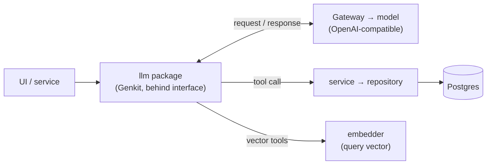
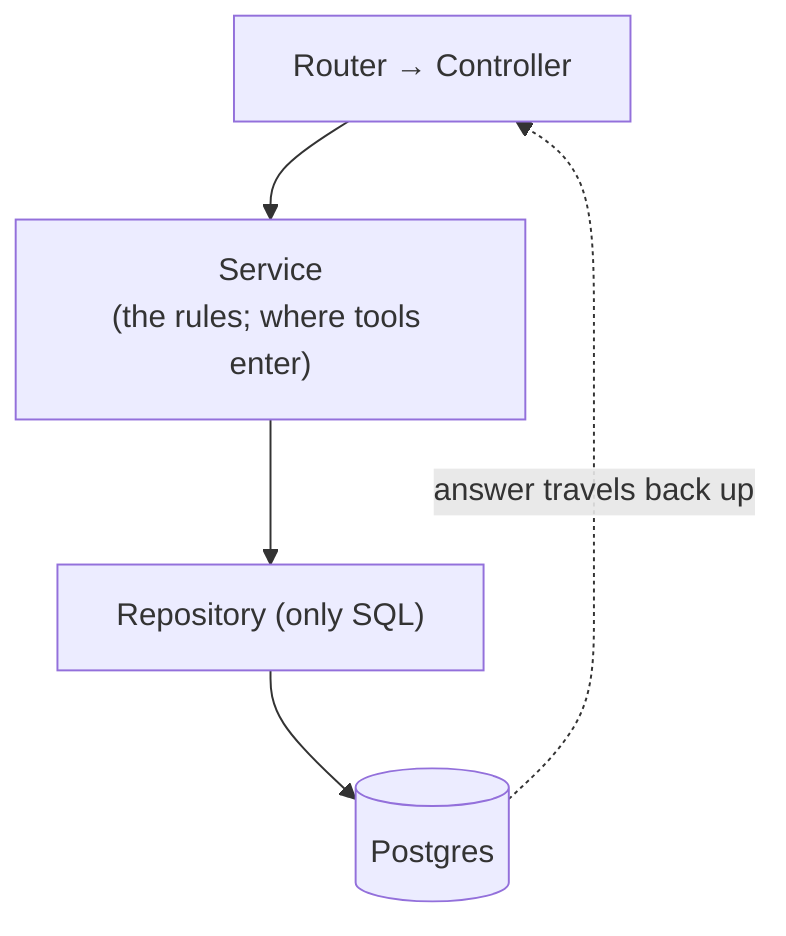
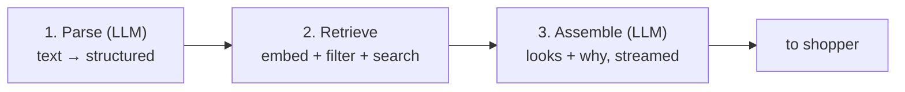

# LLM Orchestration: Design Doc (#27)

**Status:** Draft for review · **Author:** Abhishek Vijay · **Parent:** #49 · **Unblocks:** #42

This covers how we build the LLM side of the stylist flow: the client, where it runs, how workflows run on top of it, how the backend calls it, and roughly what it costs. It's about the infrastructure, not the prompts or feature logic for any one use case (parsing, look-building, swaps, tagging), which come later on top of whatever we pick here.

A guiding constraint is that the design should make the framework easy to swap, so the real deliverable is less which framework than a clean boundary that keeps the choice reversible. The recommendation is a reasoned default behind that boundary.

---

## Recommendation

Build the LLM layer **in-process in the Go backend**, as a new `llm` package beside `embedder` and `storage`, behind a Go interface we own. Use **Genkit Go** (Google, Apache-2.0), with **Eino** as a ready alternative behind the same interface.

The choice between Genkit and Eino is close, and the interface keeps it from being a lock-in. We recommend Genkit; the question that would tip it to Eino is covered below.

### Why in-process

The LLM layer runs no model of its own and needs no special hardware; it only makes HTTPS calls to a gateway. That's unlike the embedder, which is a separate Python service on Modal because it runs FashionCLIP on a GPU. With neither constraint, the simplest home is inside the backend we already deploy: one language, one deploy, no network hop, no second service to secure or monitor, and it avoids running a second process across the network. A separate service would buy more mature orchestration, but v0 can't use that yet (the tools an agent would orchestrate don't exist), so we'd pay cost and latency for capability we can't exercise.

### Why Genkit (lead)

- **GA with a real stability promise.** Genkit Go is 1.0 and follows semantic versioning, so its stable API only breaks on major releases. Everything v0 needs (model client, structured output, tool calling, streaming, flows, retry/fallback) is in that stable channel.
- **The gateway requirement is met first-class.** Genkit ships a dedicated OpenRouter plugin with its own test suite, plus a general OpenAI-compatible plugin taking a custom `BaseURL` and headers, so the gateway is a config value and switching models is a config change. Its OpenAI client is the official `openai-go` SDK, not a fork.
- **No friction with our repo.** We're on Go 1.27.1, past Genkit's Go 1.25 requirement, so no toolchain bump.
- **Good ergonomics for a deadline:** typed output from Go structs, a local dev UI with a trace explorer, monthly releases, Google maintenance.

The caveat: Genkit's **sessions and human-in-the-loop interrupts are in its beta channel** (can break on minor releases). v0 doesn't need them. We build on the stable core, and the agentic tool-calling we do need is part of the stable tool-calling API, not the beta layer.

### Eino (the close alternative)

Eino is the framework to switch to if we want first-class, non-beta agent and graph machinery sooner. Its agent layer and compose/graph engine are core, non-experimental parts of the framework, it's battle-tested at ByteDance scale, and we verified its OpenAI-compatible `BaseURL` path in its source. Since it implements the same `Client` interface, moving to it is one new adapter plus one wiring line, with no caller, tool, or endpoint changes.

Why it's the alternative, not the lead:
- It's pre-1.0 (v0.x) with recent breaking changes. They're documented with migration guides and cluster in the fast-moving agent layer (reworked as recently as ~a month ago), not the core v0 would build on. Pinning the version plus the interface wrapper contain this.
- On our Go version (1.27), its `sonic` dependency prints a startup warning and falls back to standard JSON. Harmless, but a wart.
- Its OpenAI client rides on an individual's `go-openai` fork rather than the official SDK.
- A graph engine is probably overkill for v0, which removes Eino's biggest edge over Genkit right now.

### LangGraph: distant third, only if we ever want a separate service

LangGraph (Python) is the most mature graph/agent framework considered, with retries, checkpointing, and human-in-the-loop as native primitives. But it's a **separate service**: a second language, a second deploy, service-to-service auth, a share of the ~$30/month Modal budget, and a network hop per request. Since we're avoiding a second process, and v0 can't use its one advantage anyway, it stays only as the direction we'd move **if** in-process Go proves insufficient. The embedder shows that path is feasible when needed.

### Ruled out

- **LangChainGo**: in Go and capable, but indefinitely pre-1.0 with no stability commitment, its README is asking for new maintainers, and it has spawned third-party forks where PRs land that upstream hasn't merged. Too much governance risk for a foundation.
- **Flue v2** (TypeScript): a separate service (same objection as LangGraph), and young, with a breaking v2 rewrite and an awkward poll-for-results API.
- **ADK-Go**: its agent core reached 1.0, but the piece we'd depend on day one, OpenAI-compatible model support, is an experimental v2 package targeting the Responses API rather than the Chat Completions format our gateways speak. Experimental on exactly the critical seam.

---

## Where it runs, and how it talks to the Go API and Postgres

### It runs in-process

The `llm` package is compiled into the existing Go backend, beside `embedder` and `storage`. It's wired exactly like the embedder, so there's no new pattern:

- config is read once in `config.Load` (gateway URL, model, API key, timeouts),
- the client is built at startup,
- it's passed down through `types.ServiceParams`, and
- it's left `nil` in `server.Spec`, so `cmd/openapi` can generate the OpenAPI spec without a live client.

### How it reaches the model

The package sends requests over HTTPS to an OpenAI-compatible gateway (OpenRouter or Cloudflare AI Gateway). Because the gateway speaks the standard format, choosing or switching models is a config change (model name and gateway), never code. This satisfies #27's "switching models is a config change" requirement.

### How it reaches Postgres

The model never queries the database directly. Data access happens through *tools*: plain Go functions the model can call. When a tool needs data, it enters at the **service layer** and goes down the existing `service → repository` path, like any other caller. This is deliberate over giving tools their own database access:

- all SQL stays in the repository layer, rather than being duplicated into tool-specific queries;
- the service layer's rules and ownership checks apply to tool calls automatically, so a tool can't read data a normal request couldn't; and
- the model can only do what a specific, named tool allows. It can't issue arbitrary queries, and shopper text in a prompt can't turn into unexpected SQL.

When the service layer lacks a query shape, the fix is to add that method there rather than carve an exception into the architecture. Vector-search tools call the embedder first, to turn query text into a vector before the `pgvector` search runs.

### How it reaches the UI (streaming)

Two kinds of caller use the package through the same interface: other Go services call it directly, and the UI reaches it through thin Huma endpoints (for example, a future quiz-form generator).

Shopper-facing calls stream their responses so the first tokens appear while the rest generates. Our stack supports this: Huma has a built-in SSE package (`sse.Register`), and SSE on the Fiber adapter (previously broken because fasthttp doesn't implement Go's `http.Flusher`) was fixed in Huma v2.39.0. We're on v2.39.1, just above that fix, so Fiber v3 SSE works. Because the fix is recent, we shouldn't downgrade Huma below v2.39.0, and the implementation ticket should confirm SSE end-to-end as a sanity check.



The layered path a request follows, and where the `llm` package and its tools attach:



---

## The interface the rest of the backend calls

This is the center of the design. The framework (Genkit, or Eino later) appears nowhere in the backend except inside one package; everything else depends on a small Go interface we own. That boundary is what makes the choice reversible, which is the main thing this design needs to guarantee.

### The interface

Callers depend on this, never on Genkit directly:

```go
type Client interface {
    // One structured result from a single call (parsing, tagging).
    Generate(ctx context.Context, req Request) (Response, error)

    // A single call whose result streams back in chunks.
    GenerateStream(ctx context.Context, req Request) (ChunkReader, error)

    // A named multi-step flow, returning its final result.
    RunWorkflow(ctx context.Context, name string, input any) (any, error)

    // A named flow that streams its user-facing step.
    RunWorkflowStream(ctx context.Context, name string, input any) (ChunkReader, error)
}
```

### Why these methods

They map to the distinct *shapes* of LLM interaction in #27, not to features. Four shapes, four methods:

- **`Generate`**: one model call returning a complete, structured result. Covers parsing shopper text and offline tagging.
- **`GenerateStream`**: a single call whose answer streams back in pieces, for shopper-facing calls where latency is felt. It's a separate method rather than a `stream: true` flag because the two return different types: a finished `Response` versus a `ChunkReader` you pull chunks from. In Go, "returns a different thing" is a different method, not a flag; a flag would force one dishonest return type every caller has to branch on.
- **`RunWorkflow`**: a *multi-step* sequence returning a final result. It differs from `Generate` by scope: it may call the model several times and call tools in between. It holds the orchestration, so step coordination stays sealed in the package and framework-shaped logic doesn't leak out and break swappability. Whether a workflow's steps are fixed (today) or agentic (later) is an implementation detail *inside* the workflow, so the interface doesn't change when a flow becomes agentic.
- **`RunWorkflowStream`**: the opt-in streaming variant. Streaming is a property of a *particular* workflow, not all of them: a tagging flow has nothing to stream, while the stylist flow has one user-facing step (assembling looks and "why" lines) worth streaming. This runs such a flow and streams only that part, while the internal steps (parse, retrieve) run silently.

*Implementation note:* whether `RunWorkflowStream` also surfaces the final structured result once streaming completes (needed if a shopper saves the look) is left to the follow-up ticket. The four-method count is deliberate; the alternatives (flags, or loose "either" return types) are worse in a statically-typed language.

### Tools and config are set up once, not per call

Two things deliberately aren't parameters:

- **Tools** (the Go functions the model may call, which reach data through the service layer) are registered when the package is built.
- **Config** (gateway URL, model, keys, timeouts) is loaded once in `config.Load`.

Both are set at construction, so a caller just calls a method and never sees a gateway URL, model name, or tool wiring. If different workflows ever need different tool sets (e.g. a shopper-facing flow that must not reach an admin-only tool), that's scoped *per workflow inside the package*, never passed by callers, so the boundary holds.

### Why this makes the framework swappable

The tools are ordinary Go functions that call our service layer and know nothing about Genkit. The config is plain values. Only the `Client` implementation touches the framework. So switching from Genkit to Eino (or a remote service) is:

1. write one new implementation of `Client` (the adapter around the new framework), and
2. change one line in `main.go` choosing which implementation to build.

No caller, endpoint, or tool changes; the tools carry over unchanged because they were never framework-specific. That one-adapter swap is the whole point of the boundary, and why choosing Genkit now is reversible rather than a lock-in.

---

## One real workflow: text prompt → structured request → looks

Using #27's own example, a shopper types: *"something casual for a brunch date, nothing too short."*

For v0 this runs as a **flow**: a fixed sequence of steps defined in code, not a fully autonomous agent. The tools an agent would call don't all exist yet, and a flow is testable with stubs today. It's entered through `RunWorkflow`, so the orchestration lives inside the `llm` package. (The data shapes below are illustrative; exact field names are an implementation detail.)

**Step 1: Parse (LLM).** One structured-output call turns the sentence into a typed request. This is the model *understanding* intent, including the negation "nothing too short" that keyword matching would miss. No tools.

```
in:  "something casual for a brunch date, nothing too short"
out: { occasion: "brunch", formality: "casual",
       categories: ["dress", "shoes"], exclude: ["very_short"] }
```

**Step 2: Retrieve (tools → embedder + Postgres).** The flow calls tools (`search_products`, later `find_pairings`) that reach data through the service layer. Here the embedder and the LLM do different jobs:

- The **descriptive** part ("casual brunch dress") goes to the embedder, which turns it into a vector for `pgvector` similarity search. This is *matching*: finding items that resemble the vibe.
- The **categorical** part becomes plain SQL filters, not embeddings: `category IN ('dress','shoes')`, and the "very_short" exclusion as a `WHERE` condition. These are exact facts, better checked than approximated.

So one query combines both: products similar to this vector, but only in the right categories, excluding very short items.

```
out: { dresses: [12 candidates], shoes: [20 candidates] }  // some filtered out
```

**Step 3: Assemble and explain (LLM).** A second call composes up to three complete looks, choosing items that work *together* (reasoning the embedder can't do), and writes the short **"why" line** each look needs (a #27 requirement). The "why" line is in the output schema from the start, not bolted on.

```
out: [
  { dress: ..., shoes: ...,
    why: "The linen dress keeps it relaxed, the flats make it brunch-appropriate." },
  ... up to 3 looks
]
```

This step streams (via `GenerateStream`), so the first look appears while the rest generate.

**How it grows toward agentic.** The flow is fixed: parse, retrieve, assemble, in order. The agentic version #27 anticipates is a natural upgrade, not a rewrite: steps 2 and 3 become a loop the model drives (search, inspect, re-search if off, check pairings, finalize) within limits we set. That loop uses the same stable tool-calling the flow already uses. Human review later (a pause-and-approve step) is where sessions/interrupts come in. Because all of this sits behind `RunWorkflow`, callers don't change when the flow becomes an agent.



*Fixed sequence for v0; steps 2–3 become a model-driven loop when the flow becomes agentic.*

---

## Rough cost and latency per request

Cost and latency come from the **model we route to**, not the framework. **These are planning estimates** from published pricing and typical token counts, not measured; #27 asks for rough figures, and a real number is a quick live call (in the follow-up ticket). The brunch workflow is roughly two model calls, on the order of 2,000 tokens.

| Model tier | Est. cost / request | Est. latency | Best used for |
|---|---|---|---|
| Cheap (small open model) | well under 1¢ | ~1–2s | offline tagging, parsing |
| Mid | ~1–3¢ | ~2–4s | shopper-facing looks |
| Premium | ~5–15¢ | ~3–6s | only if quality demands it |

Latency is dominated by the model calls; the tool and embedder calls are fast by comparison.

---

## What else we need, and what to weigh

### Practical items for the follow-up

- **A live gateway call** through OpenRouter on the chosen model, to replace the estimated figures with a measured one.
- **The Genkit vs. Eino decision** (below). We lean Genkit, but it's close and may shift with the product's needs.
- **A review of the interface design** and how it connects to the rest of the code.
- **Future framework changes.** Both Eino and Genkit are still evolving. How do we limit the impact of future version changes (pinning, the interface wrapper)?

### The open decision: Genkit vs. Eino

We recommend Genkit, but the call is close, and the interface is meant to keep the two interchangeable.

**For Genkit (lead):**
- GA (1.0) with a formal promise not to break its stable API except on major versions. Eino is pre-1.0, with breaking changes as recently as ~a month ago (in its agent layer, documented with migration guides).
- Cleaner, first-party docs, a dedicated OpenRouter plugin with its own tests, and the official OpenAI SDK.
- Fits our repo with no toolchain change (Go 1.27.1, past Genkit's 1.25 need); Eino prints a warning and falls back to standard JSON on Go 1.27 via its `sonic` dependency.
- Better developer tooling (local dev UI, trace explorer, typed output).

**For Eino (alternative):**
- More independent Go adoption and coverage: more GitHub stars (~11k vs Genkit's ~6k across all languages), battle-tested at ByteDance scale with resilience patterns built in.
- Its agent and graph machinery is first-class and non-experimental, while Genkit's sessions/interrupts are beta.
- Verified its OpenAI-compatible gateway path in source.
